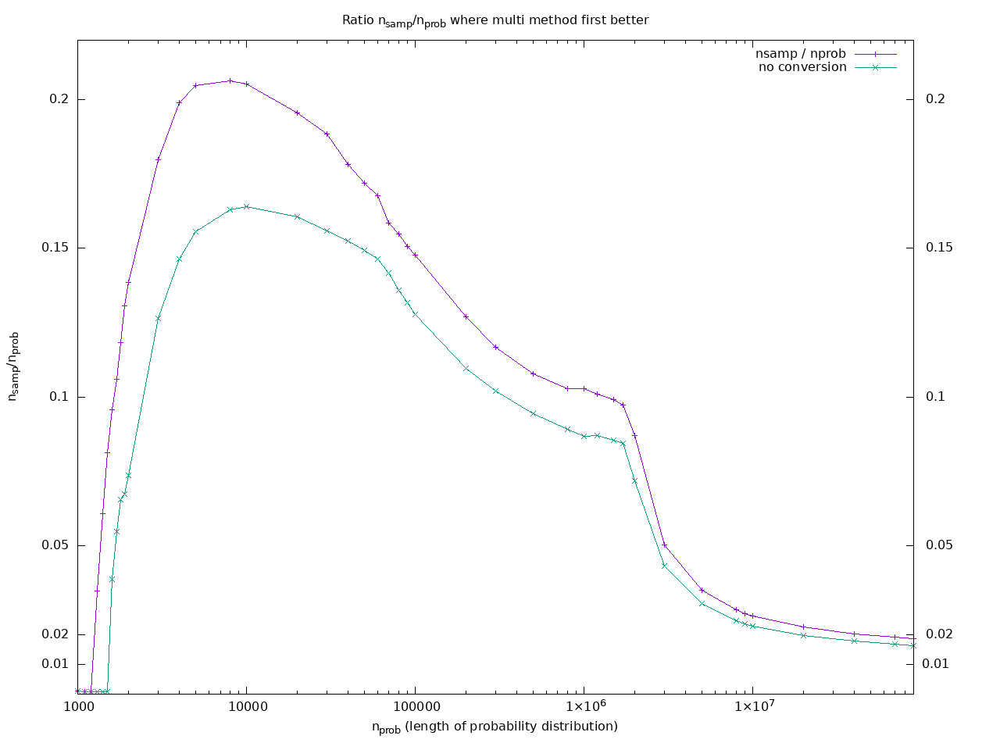

### Sampling problem

We want to collect $n$ samples from the probability distribution $p(i), i=1,\ldots k$ and
return the number of times that each value of $i$ was sampled. This corresponds to binning
shots (with the finest bins).

There are at least two ways to do this sampling. We can either perform the procedure just described,
or alternatively, sample once from the associated multinomial distribution. Both give counts with
the same statistics.  The question is when should we prefer one over the other? Let's give them
names

* The *categorical* method. The first method above. (The first step is sampling from the
  categorical distribution $\mathbf{p}=(p_1,\ldots,p_k)$.)
* The *multinomial* method. The second method above. Draw a single sample from a multinomial distribution.

#### Motivation

Qiskit provides this sampling in various places. For example `quantum_info` and in `qiskit-aer`. Making
it efficient is useful, especially if we can reduce the time complexity. Sampling in some regimes can be
quick rather than strictly impossible if we use the right method.

#### Time complexity
* Both methods are at least linear in $k$, i.e. $O(k)$ in $k$. I guess all reasonable programming language
  implementations are really $O(k)$.
* The multinomial method is $O(1)$ in $n$. The categorical method is $O(n)$. So for large enough $n$,
  multinomial is better.
* In practice there are complicating factors: pre- and post-processing, data structures, PL constraints, whether you want to
  do sampling repeatedly. There are different sub-algorithms that can be chosen for each of the two methods.

### A few of the issues that affect which is better

Note that the multinomial method is always better for large enough $n$ .

* Language choice. Eg. limitations of numpy. Ability to do multithreading. Libraries available.
  The same algorithm can perform differently in different compiled langages. Existence and performance
  of multiple threads?
* There are several algorithms for sampling from a categorical distribution. Some have an upfront cost.
  Some don't: Binary search, alias table, etc.
* There are several algorithms for sampling from a multinomial distribution. Some implementations choose
  among them conditionally. I think the choices are perhaps not always best.
* The data format expected at the end. It takes extra work to convert one of them to the format of the other.
  They both have the same penalt to get to the final format.
* Which method is better will depend on characteristics of $\mathbf{p}$. In experiments, I choose
  iid uniformly distributed $p_i$.

#### Better way to store counts data

* Store data in plain format: best is numpy arrays of some kind of machine ints or floats.
* Get fancier formats an needed information in meta data.
* Methods to convert to format required by consumer
* Methods to print or display in friendly or desired format. Eg: 1 -> '00001'.

#### Advantages of basic data types

* Faster to process: read, write, serialize.
* Scales much better than dicts with strings as keys.
* Easier to interoperate with other languages. Eg. compiled languages. They can send and receive
  arrays of ints and floats.
* Less complexity in code that creates and manipulates them. The complexity is moved to
  conversion and display routines.

### Benchmark results

The multinomial method is always better for large enough $n$. I did benchmarks to determine
the value of $n$ above which multinomial is better.

A main takeaway is that this crossover always occurs for $n/k$ well below $1$. This means
that the expected number of counts for each $p_i$ is less than $1$. It's probably not useful
to sample in this regime. (There are caveats below, eg, this does not consider $\mathbf{p}$ 
with structure.)

I did the following benchmark
1. Fix $k$ (the length of the probability distribution $\mathbf{p}$).
2. Choose a random $p$. Each element is iid, uniform on $(0, 1)$. Normalize the result.
3. Choose $n$ the number of samples.
4. Record the time for sampling via the categorical method.
5. Record the time for sampling via the multinomial method.
6. Adjust $n$ via binary search for the value such that the two times are closest. Go to step 3.
   Break when the best $n$ is found.
7. Record the pair $(k, n)$. Recall $k$ was chose, and $n$ computed.
8. Increment $k$ by some amount and go to step 1. Break when $k$ reaches a predetermined limit.

You can use the results like this: The user sends a distribution $\mathbf{p}$ and a number of
samples $n_{in}$. Look up a pair $(k, n)$ in the table by the value of the input $k$.
If $n_{in}$ is larger than $n$ from the table, then use the multinomial method. Otherwise use
the categorical

Here are a few of the caveats
* This assumes that the input probabilities are similar to those we used in the benchmarks. This is
  probably a bad assumption. There are many circuits that result in most probability concentrated one
  a small number of output strings.

Some further details of the data plotted below.
* Everything was done with numpy. There is code for doing this in C++ and Julia elsewhere in this repo.
* No output data is converted to a `dict`, although this is the current data format used in Qiskit.
* I did the multinomial method two ways: 1) keep the format returned by the numpy function `unique`.
  2) Convert this output to the format produced by `np.nonzero`. The latter is the same format that
  the categorical method returns. There are two curves below. The threshold is of course higher if
  we do the extra conversion step. Purple curve includes conversion. Green curve omits conversion.
* I don't know (or have forgotten for the moment) the algorithms used in the functions below.
* Functions used
    * `rng.uniform` to make $\mathbf{p}$.
    * `rng.choice` to sample from $\mathbf{p}$.
    * `np.unique` to reduce the results in the latter step.
    * `rng.multinomial` to sample from the multinomial distribution.
    * `np.nonzero` and indexing into an array with an array to convert the single array in the
       last step to a pair of arrays similar to those returned by `np.unique`. This final step
        was omitted for the green curve below.

<!--  LocalWords:  ldots multinomial mathbf Qiskit qiskit aer pre numpy iid ints Eg '00001 dicts np
 -->
<!--  LocalWords:  interoperate repo rng
 -->
